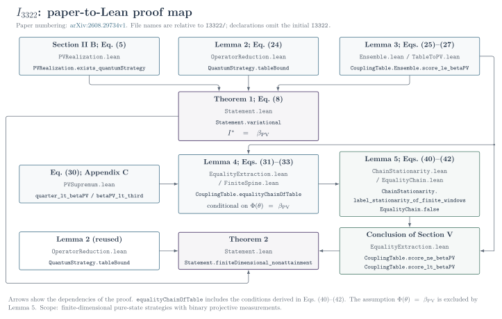

# I3322 in Lean 4

[](https://github.com/jefpauwels/i3322-lean/actions/workflows/lean.yml)

This repository formalizes Theorems 1 and 2 of
[*The quantum supremum of the I3322 Bell inequality is not attained in finite dimension*](https://arxiv.org/abs/2608.29734v1).
The paper gives the mathematical argument; the tables below locate its definitions
and proof steps in Lean. All references use **arXiv:2608.29734v1** ([PDF](https://arxiv.org/pdf/2608.29734v1)).

## Definitions and statements

Start with [Statement.lean](I3322/Statement.lean). It collects every
project-specific definition needed to read the two theorems, with paper
references beside the formulas. Its final section connects these definitions
to the existing proof by proving equality of the complete sets of values.

Names in this table have prefix `I3322.Statement.`

| Paper | Lean declaration |
| --- | --- |
| Sec. II A; pure states and projective measurements in Sec. III A | [QuantumStrategy](I3322/Statement.lean#L33), [QuantumStrategy.expectation](I3322/Statement.lean#L61) |
| Eq. (1): Bell functional | [QuantumStrategy.value](I3322/Statement.lean#L82) |
| Eq. (2): quantum supremum | [quantumSupremum](I3322/Statement.lean#L94) |
| Eqs. (4)–(5): PV coefficients and value | [s, d](I3322/Statement.lean#L100), [PVChain.value](I3322/Statement.lean#L139) |
| Eq. (7): finite PV domain and supremum | [PVChain](I3322/Statement.lean#L112), [betaPV](I3322/Statement.lean#L147) |
| Theorem 1, Eq. (8): $I^*=\beta_{\mathrm{PV}}$ | [variational](I3322/Statement.lean#L258) |
| Theorem 2: finite-dimensional nonattainment | [finiteDimensional_nonattainment](I3322/Statement.lean#L264) |
| Sec. II B: every PV value is a quantum value | [pvValue_attained](I3322/Statement.lean#L281) |
| Eq. (30): $1/4<\beta_{\mathrm{PV}}<1/3$ | [betaPV_bounds](I3322/Statement.lean#L288) |

Lean counts measurements and Schmidt coefficients from zero: `alice 0` is $A_1$ and
`amplitude 0` is $\lambda_1$. States and Schmidt coefficients may be unnormalized;
the definitions divide by $\langle\psi|\psi\rangle$ and $\sum_i\lambda_i^2$, respectively.
Both suprema are Mathlib's `sSup`, which is the least upper bound of a set of reals
that is nonempty and bounded above and is `0` otherwise; the file proves both
properties for both sets. The last two rows are consistency checks: the Bell
functional and Born rule reproduce Eq. (5) on the PV family, and $\beta_{\mathrm{PV}}$
lies in the interval of Eq. (30).

## Proof correspondence

Names below have prefix `I3322.` Links open the relevant proof declarations.

| Paper | Lean declaration |
| --- | --- |
| Sec. II B: realization of Eq. (5) | [PVRealization.exists_quantumStrategy](I3322/PVRealization.lean#L1209) |
| Eqs. (19), (23): marginals and $\Phi(\theta)$ | [CouplingTable.row, column, score](I3322/CouplingTable.lean#L28) |
| Lemma 2, Eq. (24): spectral-weight bound | [QuantumStrategy.tableBound](I3322/OperatorReduction.lean#L1990) |
| Eqs. (25)–(26); Appendix B: matching conditions | [CouplingTable.Ensemble.walkEnsemble_diagonalMatches, walkEnsemble_junctionMatches](I3322/Ensemble.lean#L617) |
| Lemma 3, Eq. (27): $\Phi(\theta)\leq\beta_{\mathrm{PV}}$ | [CouplingTable.Ensemble.score_le_betaPV](I3322/TableToPV.lean#L262) |
| Eq. (30); Appendix C: coarse bounds | [quarter_lt_betaPV, betaPV_lt_third](I3322/PVSupremum.lean#L20) |
| Lemma 4, Eqs. (31)–(33): consequences of equality | [CouplingTable.exists_supportSpine](I3322/EqualityExtraction.lean#L1872), [CouplingTable.SupportSpine.toValueSpine](I3322/EqualityExtraction.lean#L2246), [CouplingTable.equalityChainOfTable](I3322/EqualityExtraction.lean#L2258) |
| Lemma 5, Eqs. (40), (42): optimality conditions | [ChainStationarity.weighted_stationarity_of_finite_windows, label_stationarity_of_finite_windows](I3322/ChainStationarity.lean#L140), [ValueSpine.clamped_label_stationarity](I3322/FiniteSpine.lean#L1263) |
| Lemma 5, Eqs. (41)–(42): contradiction | [EqualityChain.false](I3322/EqualityChain.lean#L141), [CouplingTable.score_ne_betaPV](I3322/EqualityExtraction.lean#L2264) |
| Theorems 1–2 | [MainTheorems.lean](I3322/MainTheorems.lean) |

The formal proof differs from the paper in two places. For Lemma 2, Lean
applies Cauchy–Schwarz to Alice's and Bob's spectral decompositions separately
and then symmetrizes the joint weights, averaging the entries at $(a,b)$ and
$(-b,-a)$. For Lemmas 4–5, Lean extends the selected finite sequence of positive
entries to a two-sided sequence whose spectral labels and coefficient ratios are
constant beyond both endpoints, and obtains the condition of Eq. (40) from bounds
on finite truncations. The PV realization uses zero padding to local dimension
$2n+1$, which leaves the value in Eq. (5) unchanged.



[Graph PDF](docs/lean_proof_graph.pdf) · [Figure source and build instructions](docs/README.md)

**Scope.** The formal theorems quantify over arbitrary finite-dimensional
complex pure states and binary projective measurements. The purification and
Naimark reduction in Sec. III A, and the compactness arguments for Corollaries
1–2, are not formalized. Neither an exact value of $\beta_{\mathrm{PV}}$ nor
infinite-dimensional attainment is asserted.

## Build and audit

From the repository root:

```sh
lake exe cache get
lake build I3322
lake env lean Audit.lean
```

The build and audit include `Statement.lean`. The final theorems have no
reduction hypotheses; helper arguments such as `tableBound` are supplied by
proved theorems. The audit reports only `[propext, Classical.choice, Quot.sound]`.
The source contains no `sorry`, `admit`, or custom axiom.

Lean, mathlib and Physlib are pinned to `v4.32.0`; exact dependency commits are
in [lake-manifest.json](lake-manifest.json).
[Citation](CITATION.cff) · [MIT License](LICENSE).
